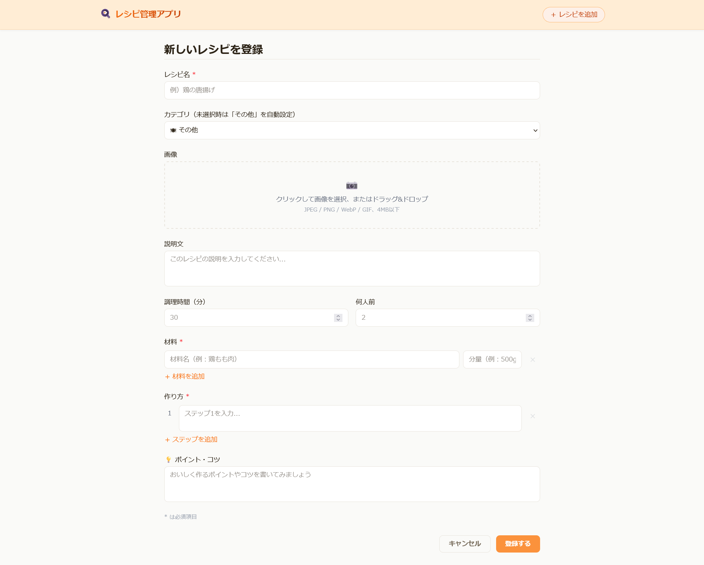
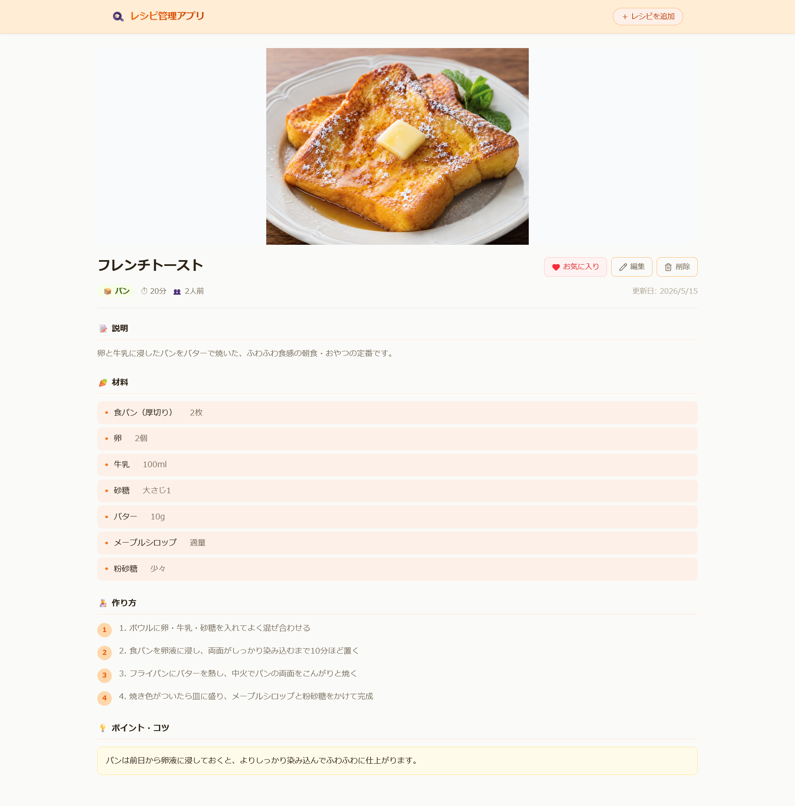
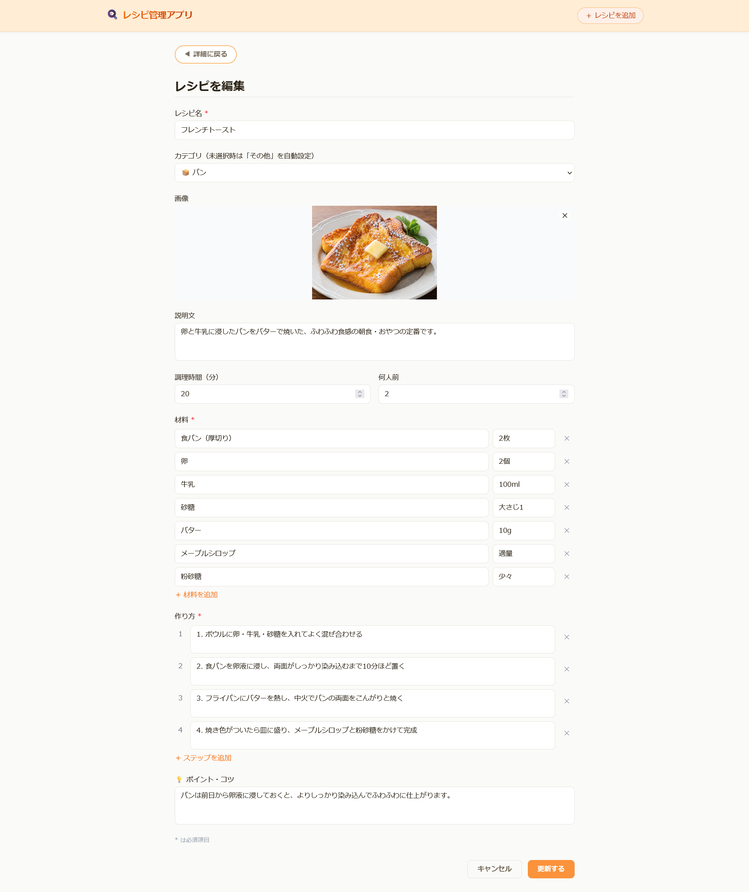

# レシピ管理アプリ（RecipeManagement）

料理レシピを一元管理する Web アプリケーション。登録・閲覧・編集・削除に加え、画像投稿・カテゴリ分類・お気に入り・検索機能を提供する。

---

## スクリーンショット

| レシピ一覧 | レシピ追加 |
|-----------|-----------|
|  |  |

| レシピ詳細 | レシピ編集 |
|-----------|-----------|
|  |  |

## デモ動画

https://github.com/saki-nakata/RecipeManagement/blob/main/docs/demo.mp4

---

## 技術スタック

| 役割 | 技術 |
|------|------|
| フロントエンド + バックエンド | Next.js 16（App Router） |
| 言語 | TypeScript |
| スタイリング | Tailwind CSS 4.x |
| ORM | Prisma 5.x |
| データベース（本番） | MySQL 8.0（AWS RDS） |
| データベース（開発） | MySQL（Docker Compose） |
| パッケージマネージャー | pnpm |
| ホスティング | AWS EC2 + RDS（Terraform 管理） |

---

## ディレクトリ構成

```
RecipeManagement/
├── docs/                    # ドキュメント類
│   ├── 要件定義書.md
│   ├── インフラ構成書.md
│   ├── API仕様書.md
│   ├── DB設計書.md
│   ├── 画面設計書.md
│   ├── 画面遷移図.md
│   ├── シーケンス図.md
│   └── バリデーション仕様書.md
├── terraform/               # インフラ定義（Terraform）
├── scripts/
│   └── deploy.sh            # ローカルから EC2 へのデプロイスクリプト
├── web/                     # アプリケーション本体
│   ├── app/
│   │   ├── api/             # API Routes（バックエンド）
│   │   ├── components/      # 共通コンポーネント
│   │   ├── lib/             # ビジネスロジック（repositories / services）
│   │   └── recipes/         # 画面（一覧・詳細・登録・編集）
│   ├── prisma/
│   │   ├── schema.prisma    # DB スキーマ定義
│   │   └── seed.ts          # 初期データ投入
│   ├── public/
│   │   └── uploads/         # アップロード画像（Git 管理外）
│   └── docker-compose.yml   # ローカル開発用 MySQL
└── docker-compose.yml       # ローカル開発用 MySQL（ルート）
```

---

## ローカル開発環境のセットアップ

### 前提条件
- Node.js 20 以上
- pnpm
- Docker Desktop

### 手順

```bash
# 1. リポジトリをクローン
git clone https://github.com/saki-nakata/RecipeManagement.git
cd RecipeManagement/web

# 2. 依存パッケージをインストール
pnpm install

# 3. 環境変数ファイルを作成
cp .env.example .env.local
# DATABASE_URL を編集（Docker Compose の MySQL に合わせる）

# 4. Docker で MySQL を起動
docker compose up -d

# 5. DB のセットアップ
pnpm run db:push     # テーブル作成
pnpm run db:seed     # 初期データ投入

# 6. 開発サーバー起動
pnpm dev
```

ブラウザで [http://localhost:3000](http://localhost:3000) を開く。

---

## 主なコマンド

```bash
pnpm dev             # 開発サーバー起動
pnpm build           # 本番ビルド
pnpm start           # 本番サーバー起動
pnpm lint            # ESLint 実行
pnpm typecheck       # TypeScript 型チェック

pnpm run db:generate # Prisma クライアント生成
pnpm run db:push     # スキーマを DB に反映
pnpm run db:seed     # 初期データ投入
```

---

## 本番環境へのデプロイ

本番環境は AWS EC2 + RDS で構成する。インフラの詳細は [docs/インフラ構成書.md](docs/インフラ構成書.md) を参照。

### 本番環境へのアクセス

EC2 のパブリック IP を確認し、ブラウザで開く。

```bash
cd terraform
terraform output ec2_public_ip
# → 表示された IP を http://<IP> でブラウザで開く
```

> EC2 を停止・再起動するとパブリック IP が変わる。

### コード変更時のデプロイ

```bash
# プロジェクトルートで実行（Git Bash / WSL）
bash scripts/deploy.sh
```

ローカルのソースファイルを rsync で EC2 に転送し、EC2 上でビルド・再起動まで自動で行う。

---

## ドキュメント

| ドキュメント | 内容 |
|------------|------|
| [要件定義書](docs/要件定義書.md) | 機能要件・非機能要件・技術スタック |
| [インフラ構成書](docs/インフラ構成書.md) | AWS 構成・デプロイフロー |
| [API仕様書](docs/API仕様書.md) | エンドポイント一覧・リクエスト/レスポンス仕様 |
| [DB設計書](docs/DB設計書.md) | ER図・テーブル定義 |
| [画面設計書](docs/画面設計書.md) | ワイヤーフレーム |
| [バリデーション仕様書](docs/バリデーション仕様書.md) | 入力値検証仕様 |
