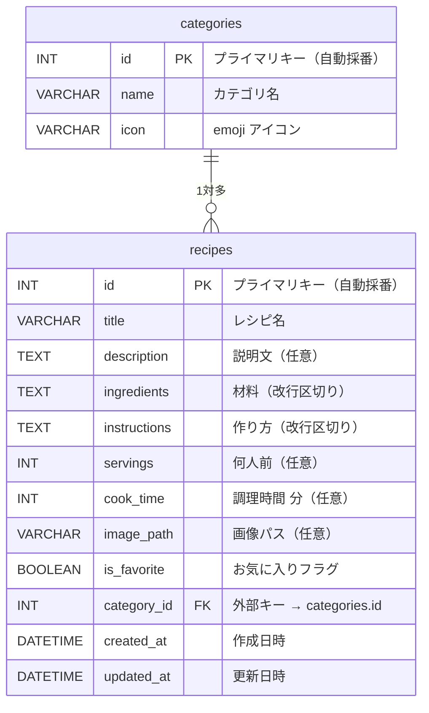
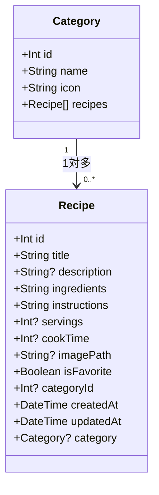

# DB設計書

**バージョン:** 1.0
**作成日:** 2026-05-09
**関連ドキュメント:** [要件定義書.md](要件定義書.md)

---

## 1. テーブル一覧

| テーブル名 | 論理名 | 説明 |
|-----------|--------|------|
| recipes | レシピ | レシピの全情報を管理するメインテーブル |
| categories | カテゴリ | レシピ分類のマスタテーブル |

---

## 2. ER図



**リレーション説明:**
- 1つのカテゴリに複数のレシピが属せる（1対多）
- レシピはカテゴリなしでも登録可能（`category_id` は NULL 許容）
- カテゴリを削除した場合、紐づくレシピの `category_id` は NULL になる（ON DELETE SET NULL）

---

## 3. クラス図

TypeScript の型定義（Prisma スキーマから生成されるモデル）を示す。



**補足:**
- `?` 付きのフィールドは任意入力（NULL 許容）
- Prisma ではキャメルケース（`cookTime`）、MySQL テーブルではスネークケース（`cook_time`）で管理

---

## 4. テーブル定義書

### 4.1 categories テーブル（カテゴリマスタ）

**テーブル説明:** レシピを分類するカテゴリの一覧を管理する。初期データとして10件のカテゴリをシードで投入する。

| No. | 論理名 | 物理名 | データ型 | 桁数 | NULL | PK | FK | デフォルト | 説明 |
|-----|--------|--------|---------|------|------|----|----|-----------|------|
| 1 | カテゴリID | id | INT | — | NOT NULL | ○ | — | AUTO_INCREMENT | 主キー・自動採番 |
| 2 | カテゴリ名 | name | VARCHAR | 100 | NOT NULL | — | — | — | 表示名（例: ご飯もの） |
| 3 | アイコン | icon | VARCHAR | 10 | NOT NULL | — | — | — | emoji（例: 🍚） |

**制約:**
- PK: `id`
- UNIQUE: `name`

---

### 4.2 recipes テーブル（レシピ）

**テーブル説明:** ユーザーが登録するレシピの全情報を管理するメインテーブル。

| No. | 論理名 | 物理名 | データ型 | 桁数 | NULL | PK | FK | デフォルト | 説明 |
|-----|--------|--------|---------|------|------|----|----|-----------|------|
| 1 | レシピID | id | INT | — | NOT NULL | ○ | — | AUTO_INCREMENT | 主キー・自動採番 |
| 2 | レシピ名 | title | VARCHAR | 255 | NOT NULL | — | — | — | レシピのタイトル |
| 3 | 説明文 | description | TEXT | — | NULL | — | — | NULL | 料理の説明・メモ |
| 4 | 材料 | ingredients | TEXT | — | NOT NULL | — | — | — | 材料（改行区切り・1行1項目） |
| 5 | 作り方 | instructions | TEXT | — | NOT NULL | — | — | — | 調理手順（改行区切り・1行1ステップ） |
| 6 | 何人前 | servings | INT | — | NULL | — | — | NULL | 提供人数 |
| 7 | 調理時間 | cook_time | INT | — | NULL | — | — | NULL | 分単位で記録 |
| 8 | 画像パス | image_path | VARCHAR | 500 | NULL | — | — | NULL | `/uploads/xxx.jpg` 形式 |
| 9 | お気に入り | is_favorite | BOOLEAN | — | NOT NULL | — | — | FALSE | お気に入りフラグ |
| 10 | カテゴリID | category_id | INT | — | NULL | — | ○ | NULL | categories.id への外部キー |
| 11 | 作成日時 | created_at | DATETIME | — | NOT NULL | — | — | CURRENT_TIMESTAMP | レコード作成日時 |
| 12 | 更新日時 | updated_at | DATETIME | — | NOT NULL | — | — | CURRENT_TIMESTAMP ON UPDATE | レコード更新日時（自動更新） |

**制約:**
- PK: `id`
- FK: `category_id` → `categories(id)` ON DELETE SET NULL

**インデックス:**

| インデックス名 | カラム | 目的 |
|-------------|-------|------|
| idx_category_id | category_id | カテゴリフィルタの高速化 |
| idx_is_favorite | is_favorite | お気に入りフィルタの高速化 |
| idx_created_at | created_at | 新着順ソートの高速化 |

---

## 5. 初期データ（シード）

### categories 初期データ

`prisma/seed.ts` で投入する。

| id | name | icon |
|----|------|------|
| 1 | ご飯もの | 🍚 |
| 2 | パン類 | 🍞 |
| 3 | 麺類 | 🍜 |
| 4 | 肉類 | 🥩 |
| 5 | 魚介類 | 🐟 |
| 6 | 野菜 | 🥦 |
| 7 | 汁物 | 🍲 |
| 8 | スイーツ | 🍰 |
| 9 | ドリンク | 🥤 |
| 10 | その他 | 🍽️ |

---

## 6. Prisma スキーマ

```prisma
generator client {
  provider = "prisma-client-js"
}

datasource db {
  provider = "mysql"
  url      = env("DATABASE_URL")
}

model Category {
  id      Int      @id @default(autoincrement())
  name    String   @unique @db.VarChar(100)
  icon    String   @db.VarChar(10)
  recipes Recipe[]

  @@map("categories")
}

model Recipe {
  id           Int       @id @default(autoincrement())
  title        String    @db.VarChar(255)
  description  String?   @db.Text
  ingredients  String    @db.Text
  instructions String    @db.Text
  servings     Int?
  cookTime     Int?      @map("cook_time")
  imagePath    String?   @db.VarChar(500) @map("image_path")
  isFavorite   Boolean   @default(false) @map("is_favorite")
  categoryId   Int?      @map("category_id")
  category     Category? @relation(fields: [categoryId], references: [id], onDelete: SetNull)
  createdAt    DateTime  @default(now()) @map("created_at")
  updatedAt    DateTime  @updatedAt @map("updated_at")

  @@index([categoryId])
  @@index([isFavorite])
  @@index([createdAt])
  @@map("recipes")
}
```
