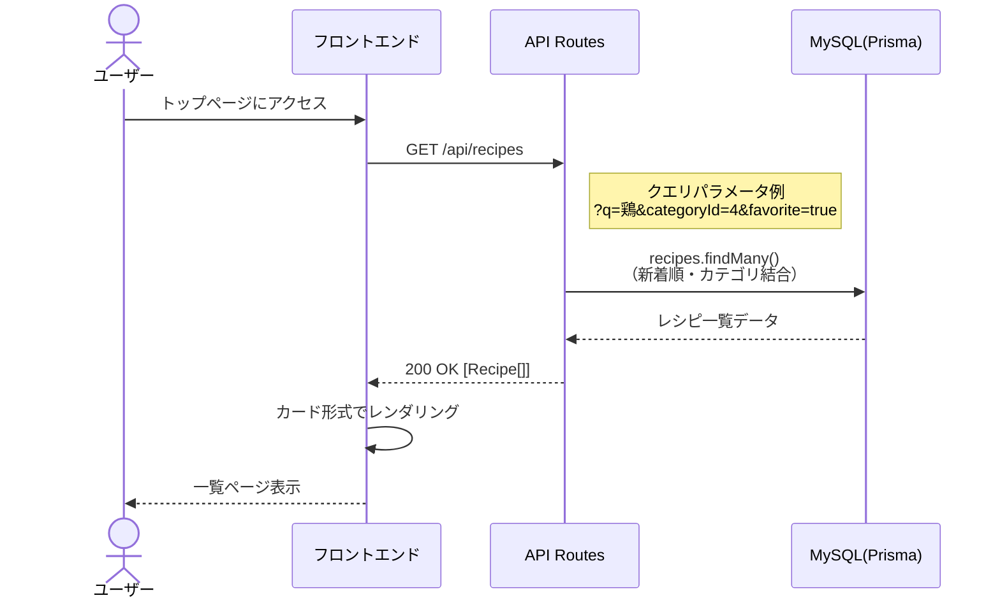
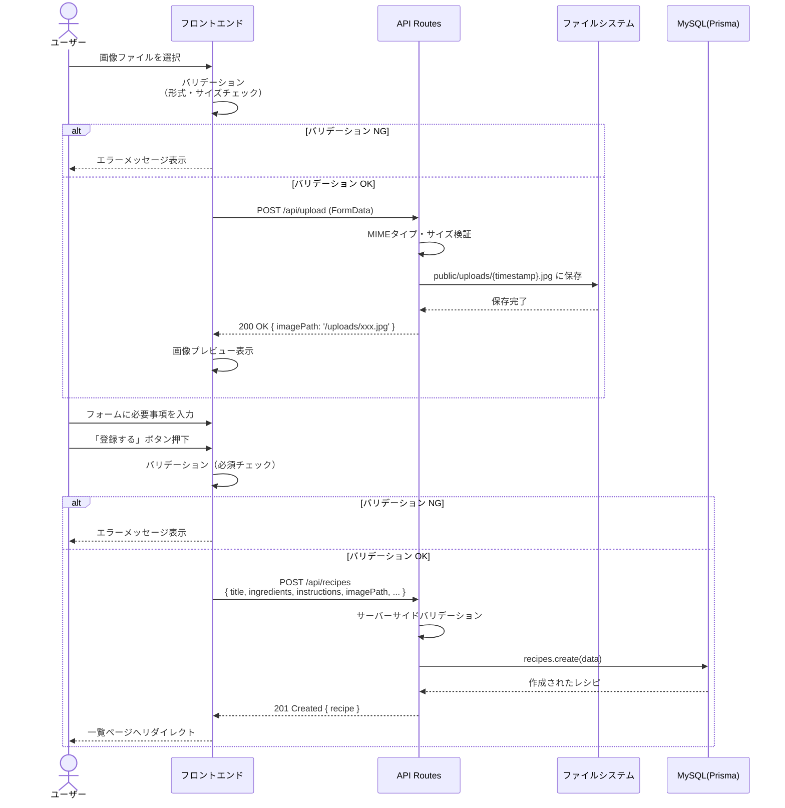
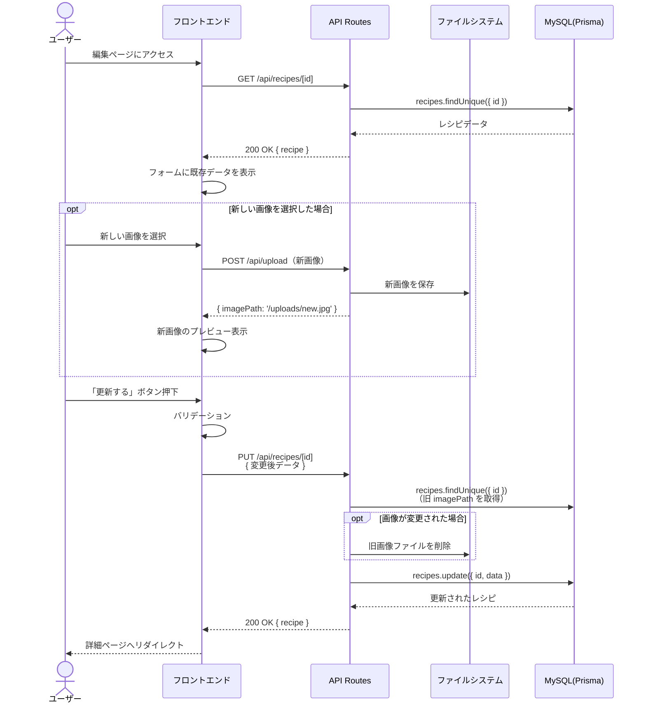
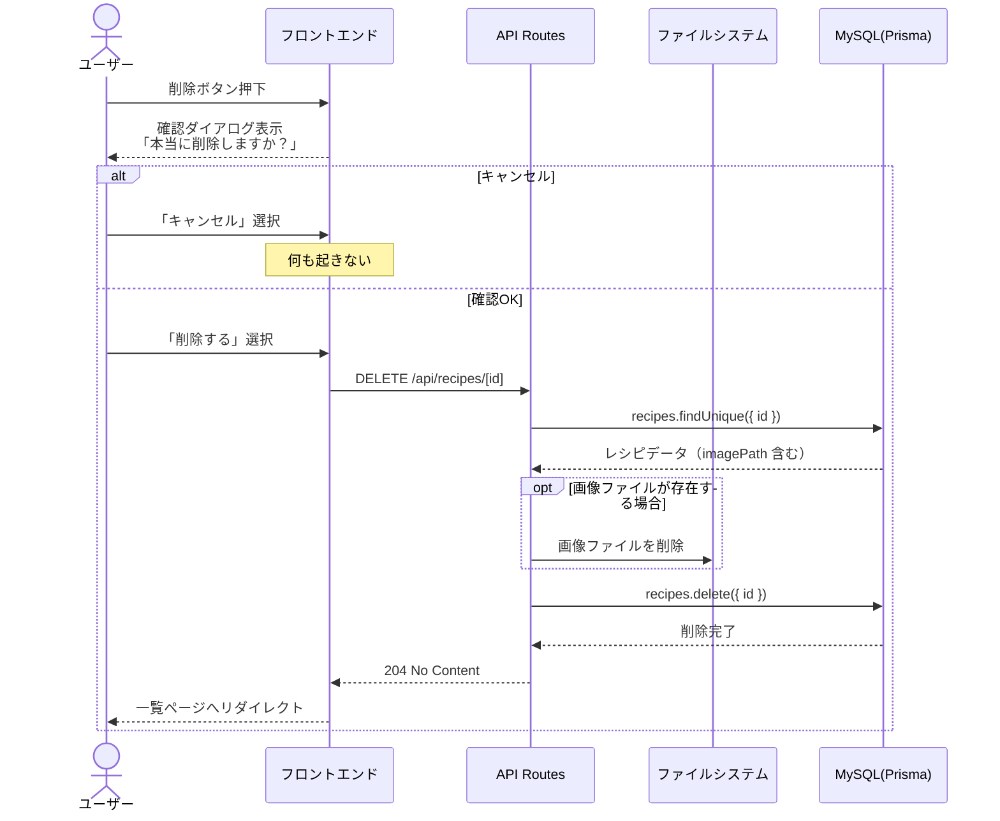
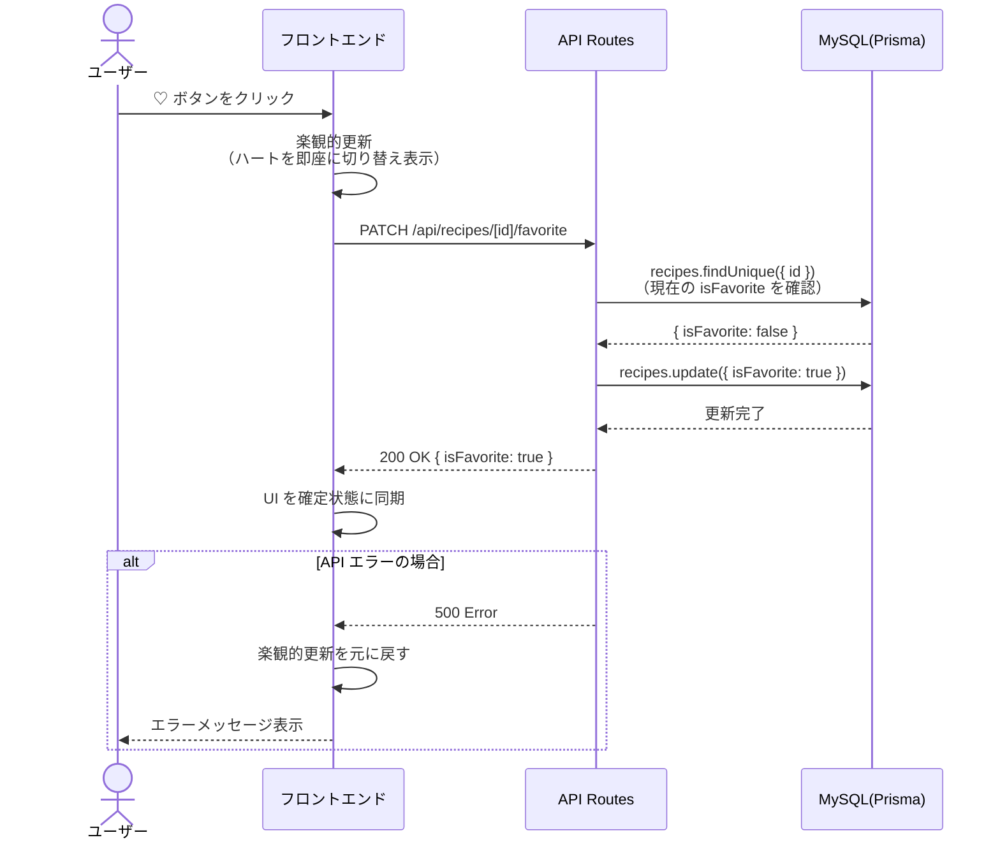

# シーケンス図

**バージョン:** 1.0
**作成日:** 2026-05-09
**関連ドキュメント:** [要件定義書.md](要件定義書.md) | [API仕様書.md](API仕様書.md)

---

## 登場人物（アクター）

| 記号 | 名前 | 説明 |
|------|------|------|
| U | ユーザー | ブラウザを操作する人 |
| FE | フロントエンド | Next.js のページ・コンポーネント |
| API | API Routes | Next.js のサーバーサイド処理 |
| FS | ファイルシステム | EC2 の `public/uploads/` ディレクトリ |
| DB | MySQL（Prisma） | データベース |

---

## 1. レシピ一覧取得フロー

---

## 2. レシピ登録フロー（画像あり）

---

## 3. レシピ編集フロー

---

## 4. レシピ削除フロー

---

## 5. お気に入りトグルフロー

