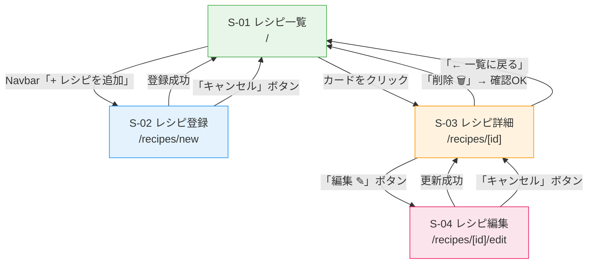

# 画面遷移図

**バージョン:** 1.0
**作成日:** 2026-05-09
**関連ドキュメント:** [要件定義書.md](要件定義書.md) | [画面設計書.md](画面設計書.md)

---

## 画面遷移図

---

## 遷移一覧

| 遷移元 | トリガー | 遷移先 | 備考 |
|--------|---------|--------|------|
| S-01 一覧 | Navbar「+ レシピを追加」 | S-02 登録 | — |
| S-01 一覧 | レシピカードをクリック | S-03 詳細 | — |
| S-02 登録 | 登録成功 | S-01 一覧 | 自動リダイレクト |
| S-02 登録 | 「キャンセル」ボタン | S-01 一覧 | — |
| S-03 詳細 | 「編集 ✎」ボタン | S-04 編集 | — |
| S-03 詳細 | 「削除 🗑」→ 確認OK | S-01 一覧 | 削除後に自動リダイレクト |
| S-03 詳細 | 「← 一覧に戻る」 | S-01 一覧 | — |
| S-04 編集 | 更新成功 | S-03 詳細 | 自動リダイレクト |
| S-04 編集 | 「キャンセル」ボタン | S-03 詳細 | — |

---

## 補足

- Navbar のアプリ名・ロゴは全画面から S-01（一覧）へ遷移する
- お気に入りボタン（♡）はページ遷移なしで状態をトグルする（楽観的更新）
- 検索・フィルタ操作は S-01 内で完結し、ページ遷移は発生しない
- 削除操作はダイアログで確認後に実行し、成功後 S-01 へリダイレクトする
